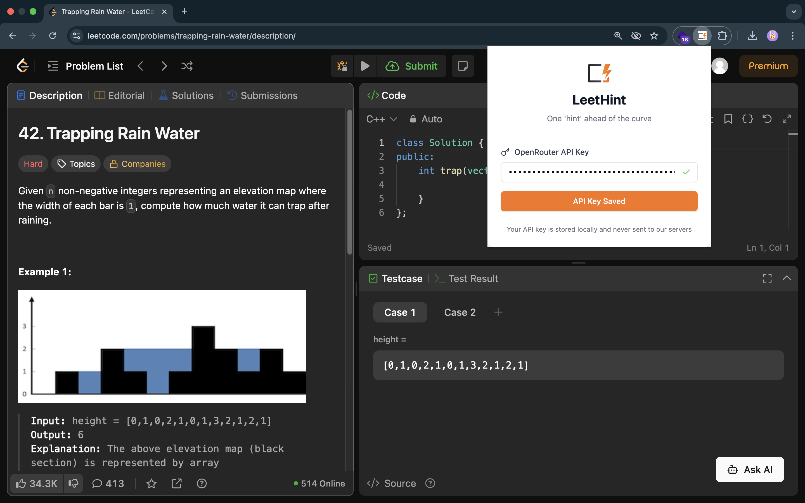
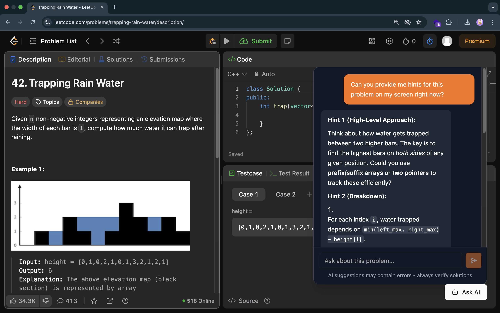

# LeetHint

**AI-Powered LeetCode Problem Solving Assistant**

LeetHint is a Chrome extension that provides intelligent, step-by-step hints for LeetCode problems using AI. Get personalized guidance to improve your problem-solving skills without spoiling the learning experience.

## Features

- **Smart Hints**: AI-driven hints that guide you through problem-solving step by step
- **LeetCode Integration**: Seamlessly integrates with LeetCode problem pages
- **Progressive Learning**: Hints that adapt to your learning pace
- **Non-Spoiler Approach**: Provides guidance without giving away complete solutions
- **Modern UI**: Clean, intuitive interface built with React and Tailwind CSS

## How it looks








## Installation

### From Source (Development)

1. **Clone the repository**
   ```bash
   git clone https://github.com/hksharma2004/leet-hint.git
   cd leet-hint
   ```

2. **Install dependencies**
   ```bash
   npm install
   ```

3. **Build the extension**
   ```bash
   npm run build
   ```

4. **Load in Chrome**
   - Open Chrome and navigate to `chrome://extensions/`
   - Enable "Developer mode" in the top right
   - Click "Load unpacked" and select the `dist` folder

### From Chrome Web Store
*Coming soon...*

## How to Use

1. **Navigate to any LeetCode problem** (e.g., `https://leetcode.com/problems/two-sum/`)
2. **Click the LeetHint extension icon** in your browser toolbar
3. **Request hints** through the popup interface
4. **Get AI-powered guidance** tailored to the specific problem
5. **Learn progressively** with hints that build upon each other

## Tech Stack

- **Frontend**: React 18, TypeScript
- **Styling**: Tailwind CSS
- **UI Components**: Radix UI primitives
- **Build Tool**: Vite
- **Extension Framework**: Chrome Extension Manifest V3
- **AI Integration**: OpenRouter AI SDK
- **Form Handling**: React Hook Form with Zod validation


### Development Commands

```bash
# Start development server
npm run dev

# Build for production
npm run build

# Run linting
npm run lint

# Preview production build
npm run preview
```

### Extension Development Workflow

1. Make your changes to the source code
2. Run `npm run build` to create the production build
3. Reload the extension in Chrome (`chrome://extensions/`)
4. Test your changes on LeetCode problems

---

<div align="center">
  <p>Made with ❤️ by <a href="https://github.com/hksharma2004">@hksharma2004</a></p>
  <p>⭐ Star this project if you find it helpful!</p>
</div>
